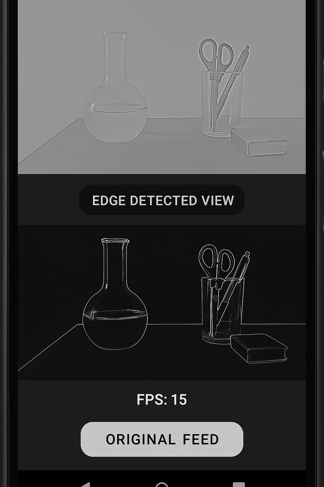

# Real-Time Edge Detection Viewer (Android + OpenCV + OpenGL + Web)

## 🚀 Features
- Real-time camera feed capture (Camera2)
- Edge detection via OpenCV in C++
- Rendering with OpenGL ES 2.0
- TypeScript web viewer (static sample frame)

## 🧩 Tech Stack
- Android SDK (Java)
- NDK (C++)
- OpenCV
- OpenGL ES 2.0
- TypeScript / HTML

## ⚙️ Setup Instructions
1. Clone repo
2. Open in Android Studio
3. Install NDK + OpenCV SDK
4. Build and run on Android device
5. Open `/web/index.html` in browser

## 📸 Screenshots

## 🧠 Architecture
Java → JNI → C++ (OpenCV) → OpenGL Renderer → Web Viewer
